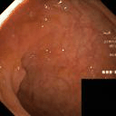

# Master Thesis for image synthesis 

## GAN and Diffusion models 
- Pix2Pix (GAN) (probably not gonna be used) 
- Guided Diffusion, to see how to train custom dataset look at https://github.com/openai/improved-diffusion

## Diffusion of polyp using 1000 steps (not looped).

## Diffusion of polyp using 250 steps, and 148 interpolated images between noise img1 and noise img 2 (total 150 images).

## Update after meeting 16.11.2022

D:/Simula_data/Models/Temp/openai-2022-11-14-23-44-04-807734/ema_0.9999_020000.pt is an example of a diffusion model only trained on clean images. 
